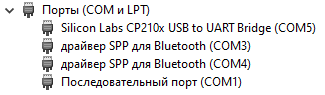
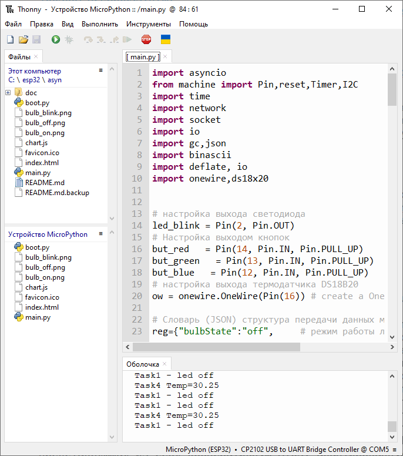

# Асинхронный веб-сервер на MicroPython 

## 1. Установка Micropython

В качестве отладочной платы для IoT устройства будем использовать широко распространенную плату espressif esp32-wroom-32 c 4&nbsp;Mb&nbsp;flash и плату расширения для удобства подключения периферии. 
 
<image src="./doc/esp32_30pin.png" alt="Описание изображения" width="300" height="300" > <image src="./doc/esp32_30pin_exp.png" alt="Описание изображения" width="300" height="250" >

[ESP32 - 30 pin Type-C](https://aliexpress.ru/item/1005007817121199.html?sku_id=12000042312153089&spm=a2g2w.productlist.search_results.3.13f665d1RsWViI) и [Плата расширения ESP32 - 30 pin ](https://aliexpress.ru/item/1005007464906653.html?sku_id=12000040865293299&spm=a2g2w.productlist.search_results.1.1dda7accL4uIo2)


После подключения отладочной платы необходимо узнать номер последовательного порта в диспетчере устройств для дальнейшей работы в программе **Thonny**. Чаще всего на отладочных платах ESP32 установлены USB-UART конверторы CH340, СР2102, редко FT232.



После подключения платы и установки драйверов, необходимо загрузить прошивку Micropython, выбрав пункт _Интерпретатор_ в меню _Параметры_ в программе **Thonny**. Все настройки показаны на рисунке ниже.

<image src="./doc/micropython.png" alt="Описание изображения" width="1000" height="500" >

Файлы _*.html_, _*.css_, _*.js_, _*.png_ и другие, использующиеся для Front-End, загружаются в корень flash памяти ESP32.



## 2. Описание проекта
Реализованный проект, который будет позволять менять режим работы светодиода  включить, отключить  и мигать. В качестве светодиод используется синий светодиод установленный на плате и подключенный в выходу D2. Менять режимы работы светодиода можно через браузер или с помощью трех кнопок, подключенных к портам отладочной платы, при этом изменение режима работы будет в течение 1000 мс будет отображено на веб-странице.  Для повышения визуализации, в проект добавлен датчик температуры DS18B20, измеренные значения которого отображаются на графике. 

<image src="./doc/ds18b20.png" alt="Описание изображения" width="400" height="300" > <image src="./doc/button.png" alt="Описание изображения" width="300" height="300" >

На рисунках ниже представлена веб-страница управления светодиодом с выводом температуры и индикацией подключения датчика температуры, а также физический макет с подключенными кнопками управления и датчиком температуры.

<image src="./doc/webpage.png" alt="Описание изображения" width="300" height="420"> <image src="./doc/maket.png" alt="Описание изображения" width="300" height="300">

Для **Frontend** применяется технология **AJAX**, обновляющая данных в браузере без обновления страницы. Применение обновления страницы через **REFRESH** приводит к загрузке памяти микроконтроллера и переполнению стека, ввиду необходимости изменения макета страницы на стороне микроконтроллера , а также показывает низкую отзывчивость и отказоустойчивость при тестировании. На стороне **Backend** применяться использование библиотеки **ASYNCIO**, представляющую из себя кооперативную RTOS, адаптированную под Micropython. Обработчик потоков веб-сервера читает и отправляет все файлы блоками по 8192 байт, что позволяет передавать файлы любого размера без переполнения стека с приемлемой скоростью. Для исключения отказа из-за переполнения стека после каждой передачи блока происходить освобождение памяти.

Принципиальная схема подключения периферии к отладочной плате ESP32 приведена на рисунке ниже.

<image src="./doc/schema.png" alt="Описание изображения" width="600" height="400">


#### Основные особенности проекта:
- Использование **асинхронной модели Backend**
- **Обновление без перезагрузки** веб-страницы 
- Передача **файлов любого размера**
- Принудительная **очистка памяти** после использования


## 3. Архитектура асинхронного программирования
На рисунке ниже показана блок-схема архитектуры программы. Расширение функционала в данной модели обеспечивается добавлением задач в планировщик, что обеспечивает быстрое повышение функциональности без необходимости повторного тестирования отлаженного кода реализованных задач.

<image src="./doc/main.png" alt="Описание изображения" width="300" height="600">

## 4. Описание обработчика потоков веб-сервера
Функция обработки потоков для задачи асинхронного веб-сервера имеет следующий вид: **async def handle_client(reader, writer)**
По-сути параметры являются указателями на объекты-потоки для чтения и записи.
Приведем пример запроса заголовку на загрузку файла bulb_blink.png с помощью GET:

> b'GET /bulb_blink.png HTTP/1.1\r\nHost: 192.168.4.1\r\nConnection: keep-alive\r\nUser-Agent: Mozilla/5.0 (Windows NT 10.0; Win64; x64) AppleWebKit/537.36 (KHTML, like Gecko) Chrome/131.0.0.0 Safari/537.36 OPR/116.0.0.0 (Edition Yx 05)\r\nAccept: image/avif,image/webp,image/apng,image/svg+xml,image/*,*/*;q=0.8\r\nReferer: http://192.168.4.1/\r\nAccept-Encoding: gzip, deflate\r\nAccept-Language: ru-RU,ru;q=0.9,en-US;q=0.8,en;q=0.7\r\n\r\n'


Пример POST-запроса на чтение температуры:
>b'POST /readData%20%7B%22bulbState%22:%22off%22,%22temp%22:25,%22tempState%22:%22online%22%7D HTTP/1.1\r\nHost: 192.168.4.1\r\nConnection: keep-alive\r\nContent-Length: 0\r\nUser-Agent: Mozilla/5.0 (Windows NT 10.0; Win64; x64) AppleWebKit/537.36 (KHTML, like Gecko) Chrome/131.0.0.0 Safari/537.36 OPR/116.0.0.0 (Edition Yx 05)\r\nAccept: */*\r\nOrigin: http://192.168.4.1\r\nReferer: http://192.168.4.1/\r\nAccept-Encoding: gzip, deflate\r\nAccept-Language: ru-RU,ru;q=0.9,en-US;q=0.8,en;q=0.7\r\n\r\n'

Пример POST-запроса на изменение режима работы светодиода :
> b'POST /sendData%20%7B%22bulbState%22:%22on%22,%22tempState%22:%22online%22,%22temp%22:30.5625%7D HTTP/1.1\r\nHost: 192.168.4.1\r\nConnection: keep-alive\r\nContent-Length: 0\r\nUser-Agent: Mozilla/5.0 (Windows NT 10.0; Win64; x64) AppleWebKit/537.36 (KHTML, like Gecko) Chrome/131.0.0.0 Safari/537.36 OPR/116.0.0.0 (Edition Yx 05)\r\nAccept: */*\r\nOrigin: http://192.168.4.1\r\nReferer: http://192.168.4.1/\r\nAccept-Encoding: gzip, deflate\r\nAccept-Language: ru-RU,ru;q=0.9,en-US;q=0.8,en;q=0.7\r\n\r\n'

После указания типа запроса идет /sendData идет JSON структура, в которой необходимо заменить коды символов на реальные символы в UTF-8 строке, то есть код символа %20 необходимо заменить на пробел. 

<image src="./doc/handler.png" alt="Описание изображения" width="700" height="840">

## 5. Краткое описание функций JS
**init_chart()** - создает объект двумерный график. 

**addData()** - функция вызывается автоматически каждую секунда для добавления данных в массив температур. 

**function sendData(cmd)** - отправляет запрос на изменение режима работы светодиода на горит, не горит, мигает, в качестве параметров принимает текст _"on"_, _"off"_, _"blink"_.

**function readData()** - функция отправляет запрос на чтение структуру состояния Backend. Вызывается каждую секунду с помощью глобального объекта *setInterval(readData, 1000);*. 

**function updateImg()** - обновляет изображение когда меняется состояние структуры  _reg_ в Backend.

**function updateTemp()** - обновляет температуру и состояние подключения термодатчика когда меняется состояние структуры _reg_ в  Backend.


## 6. Проблемы

В процессе отладки кода одна отладочная плата вышла из строя и перестала  подключаться по WI-FI. Перепрошивка различных версий Micropython не дала результата. При этом другие функции платы работали.

Проблемы возникли также при работе с графиком в JS. При инициализации объекта в теле скрипта <u>график не отображается</u>.
```javascript
let myChart = new Chart(ctx, {});
```

В чем причина, понять не удалось. Для обхода проблемы опытным путем была создана функция инициализации объекта график **init_chart()**.

## Выводы
Проект является шаблоном для создания веб-интерфейсов по управлению микроконтроллерами и датчиками через основные протоколы I2C и SPI, а также регистрации редких событий во внутреннюю память в простом текстовом формате. При необходимости данные могут быть записаны на карту SD, данный модуль поддерживается для ESP32. 

